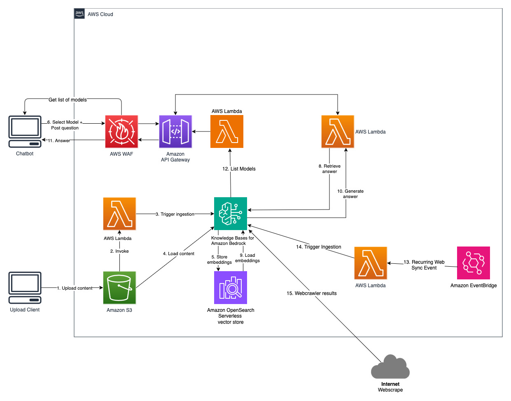
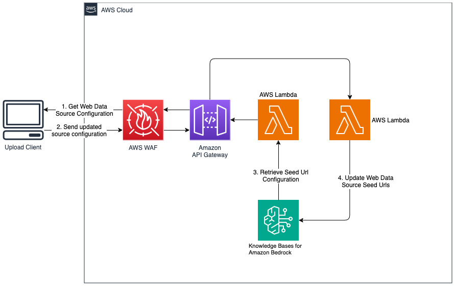
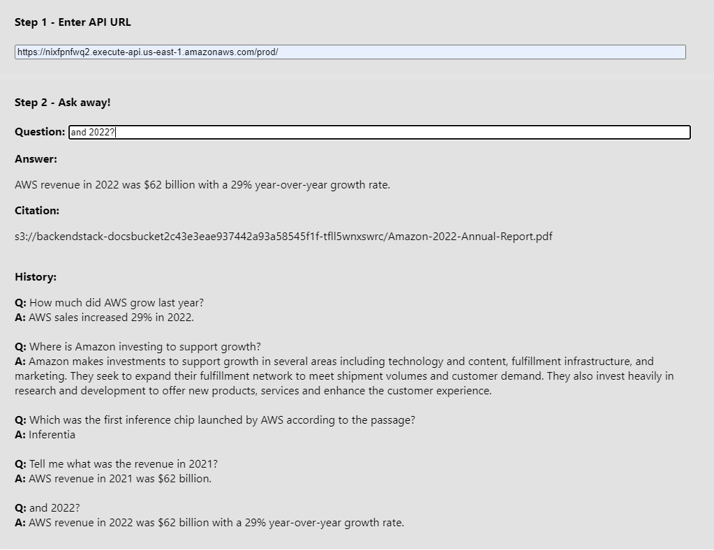

# Implement a fully managed RAG solution using Knowledge Bases for Amazon Bedrock

Retrieval-Augmented Generation (RAG) is the process of optimizing the output of a large language model, so it references an authoritative knowledge base outside of its training data sources before generating a response. Large Language Models (LLMs) are trained on vast volumes of data and use billions of parameters to generate original output for tasks like answering questions, translating languages, and completing sentences. RAG extends the already powerful capabilities of LLMs to specific domains or an organization's internal knowledge base, all without the need to retrain the model. It is a cost-effective approach to improving LLM output so it remains relevant, accurate, and useful in various contexts. Learn more about RAG [here](https://aws.amazon.com/what-is/retrieval-augmented-generation/).

[Amazon Bedrock](https://aws.amazon.com/bedrock/) is a fully managed service that offers a choice of high-performing foundation models (FMs) from leading AI companies like AI21 Labs, Anthropic, Cohere, Meta, Stability AI, and Amazon via a single API, along with a broad set of capabilities you need to build generative AI applications with security, privacy, and responsible AI. Using Amazon Bedrock, you can easily experiment with and evaluate top FMs for your use case, privately customize them with your data using techniques such as fine-tuning and RAG, and build agents that execute tasks using your enterprise systems and data sources. Since Amazon Bedrock is serverless, you don't have to manage any infrastructure, and you can securely integrate and deploy generative AI capabilities into your applications using the AWS services you are already familiar with.

[Knowledge Bases for Amazon Bedrock](https://aws.amazon.com/bedrock/knowledge-bases/) is a fully managed capability that helps you implement the entire RAG workflow from ingestion to retrieval and prompt augmentation without having to build custom integrations to data sources and manage data flows. Session context management is built in, so your app can readily support multi-turn conversations.

As part of creating a knowledge base, you configure a data source and a vector store of your choice. A data source connector allows you to connect your proprietary data to a knowledge base. Once you’ve configured a data source connector, you can sync or keep your data up to date with your knowledge base and make your data available for querying. Amazon Bedrock first splits your documents or content into manageable chunks for efficient data retrieval. The chunks are then converted to embeddings and written to a vector index (vector representation of the data), while maintaining a mapping to the original document. The vector embeddings allow the texts to be mathematically compared for similarity.

This project is implemented with two data sources; a data source for documents stored in Amazon S3 and another data source for content published on a website. A vector search collection is created in Amazon OpenSearch Serverless for vector storage.

## Solution Architecture Diagrams

Q&A Chatbot


Add new websites for web datasource


- Note that with Amazon OpeSearch Serverless, you will be billed for [4 OCUs at a minimum](https://aws.amazon.com/opensearch-service/pricing/#Amazon_OpenSearch_Serverless) at all times. Follow instructions in the [Cleanup](#cleanup) section to avoid charges.

## Deploy solution

### Prerequisite

- Install and configure [AWS CLI](https://aws.amazon.com/cli/)
- Install and bootstrap [AWS CDK](https://aws.amazon.com/cdk/)
- Pick a region from the Amazon Bedrock [Supported Regions](https://docs.aws.amazon.com/bedrock/latest/userguide/bedrock-regions.html)

### Backend

- Clone this repository to your local computer.
- From the backend folder, run "npm install" to install all dependencies. Use "npm audit" to check for known vulnerabilites on the dependent packages.
- Use CDK to deploy the backend to AWS. For example,

```
cdk deploy --context allowedip="xxx.xxx.xxx.xxx/32"
```

Provide an client IP address that is allowed to access the API Gateway in CIDR format as part of the 'allowedip' context variable.

When the deployment completes,

- Make note of the API Gateway URL shown at BackendStack.APIGatewayUrl output.
- Make note of the S3 bucket name shown at BackendStack.DocsBucketName output.

### Amazon Bedrock foundational model

This solution allows users to select which foundational model they want to use during the retrieval and generation phase. The default model is **Anthropic Claude Instant**. For the knowledge base embedding model, this solution uses **Amazon Titan Embeddings G1 - Text** model. Make sure you have [access to these foundation models](https://docs.aws.amazon.com/bedrock/latest/userguide/model-access.html).

### Upload content to S3 bucket

Get a recent publicly available Amazon's annual report and copy it to the S3 bucket name noted previously. For a quick test, you can copy the [Amazon's 2022 annual report](https://s2.q4cdn.com/299287126/files/doc_financials/2023/ar/Amazon-2022-Annual-Report.pdf) using the [AWS S3 Console](https://docs.aws.amazon.com/AmazonS3/latest/userguide/upload-objects.html). The content from the S3 bucket will be automatically synchronized with the knowledgebase because the solution deployment watches for new content in the S3 bucket and triggers an ingestion workflow.

### Synchronize web content

The deployed solution initializes the web data source called "WebCrawlerDataSource" with the url `https://www.aboutamazon.com/news/amazon-offices`. You need to synchronize this Web Crawler data source with the knowledgebase from the AWS console manually to search against the website content because the website ingestion is scheduled to happen in the future time. Select this data source from the Knowledge based on Amazon Bedrock console and initiate a "Sync" operation. See [Sync your data source with your Amazon Bedrock knowledge base](https://docs.aws.amazon.com/bedrock/latest/userguide/knowledge-base-ingest.html) for details. Note that the website content will be available to the Q&A chatbot only after the synchronization is completed. Please use this [guidance](https://docs.aws.amazon.com/bedrock/latest/userguide/webcrawl-data-source-connector.html) when setting up websites as a datasource.

### Frontend

- From the frontend folder, run "npm install" to install the packages.
- Optionally, you can run "npm audit --omit=dev" to check on vulnerabilities.
- Run "npm run start" to launch the frontend application from the browser.
- Use the user interface shown in the browser.
- For Step 1, enter the API Gateway endpoint URL noted previously.
- For Step 2, select the model you want to use for RAG. The default model is **Anthropic Claude Instant**.
- For Step 3, you can enter a question of the form "Which cities have offices?" and press the enter key to see the generated answer including a citation.
  

## Cleanup

Use "cdk destroy" to delete the stack of cloud resources created in this solution deployment.

## Security checks

- npm audit is used to confirm there are no vulnerabilities.
- SonarQube is used in VS Code to confirm there are no problems detected in the codebase.
- [Amazon Q Developer](https://docs.aws.amazon.com/amazonq/latest/qdeveloper-ug/security-scans.html) project scan is run to confirm there are no vulnerabilities in the codebase.
- S3 bucket created in this project is setup to enforce ssl requests only and encrypt data at rest.
- S3 bucket is setup to block public access.
- API Gateway is setup with AWS Web Application Firewall to allow requests from a specific IP address only.

## Credit

- [Knowledge Bases now delivers fully managed RAG experience in Amazon Bedrock](https://aws.amazon.com/blogs/aws/knowledge-bases-now-delivers-fully-managed-rag-experience-in-amazon-bedrock/)
- [Building Serverless Resume AI](https://community.aws/content/2bi5tqITxIperTzMsD3ohYbPIA4/easy-rag-with-amazon-bedrock-knowledge-base?lang=en)
- [Implementing Web Crawling in Amazon Bedrock](https://aws.amazon.com/blogs/machine-learning/implement-web-crawling-in-knowledge-bases-for-amazon-bedrock/)
